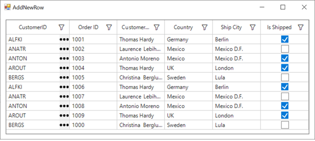

# how-to-add-the-button-and-text-in-gridtextcolumn-in-winforms-datagrid

## About the sample
This example illustrates how to add the Button and Text in GridTextColumn in WinForms DataGrid (SfDataGrid).

By default, you can add either text or button in a GridColumn but, you can add both button and text in a column by customizing GridTextBoxCellRenderer. In the custom renderer, the OnRender method can be overridden to draw buttons in the cells.

```C#
public class GridTextButtonCellRenderer : GridTextBoxCellRenderer
{
public GridTextButtonCellRenderer(SfDataGrid dataGrid)
{
    IsEditable = true;
    DataGrid = dataGrid;
}
protected override void OnRender(Graphics paint, Rectangle cellRect, string cellValue, CellStyleInfo style, DataColumnBase column, RowColumnIndex rowColumnIndex)
    {
        base.OnRender(paint, cellRect, cellValue, style, column, rowColumnIndex);

        //To set the rectangle for button in the cell.
        var rect = new Rectangle(cellRect.Location.X + cellRect.Width - 22, cellRect.Location.Y, 20, cellRect.Height);

        (column.GridColumn as GridTextButtonColumn).CellButton = new CellButton();
        (column.GridColumn as GridTextButtonColumn).CellButton.Image = Image.FromFile(@"..\..\Images\icons.png");
        (column.GridColumn as GridTextButtonColumn).CellButton.TextImageRelation = TextImageRelation.ImageBeforeText;

        PropertyInfo highlightedItemProperty = (column.GridColumn as GridTextButtonColumn).CellButton.GetType().GetProperties(BindingFlags.NonPublic | BindingFlags.Instance).Single(pi => pi.Name == "Bounds");
        highlightedItemProperty.SetValue((column.GridColumn as GridTextButtonColumn).CellButton, rect);

        //To draw the button in cell
        DrawButton(paint, cellRect, rect, "...", new ButtonCellStyleInfo(), column, rowColumnIndex);

}
}
```
```C#
//To add custom renderer into SfDataGrid.
this.sfDataGrid.CellRenderers.Add("TextButton", new GridTextButtonCellRenderer(this.sfDataGrid));

//To add TextButtonColumn in grid
this.sfDataGrid.Columns.Add(new GridTextButtonColumn() { MappingName = "CustomerID", Width = 140 });
```
## Requirements to run the demo
Visual Studio 2015 and above versions


